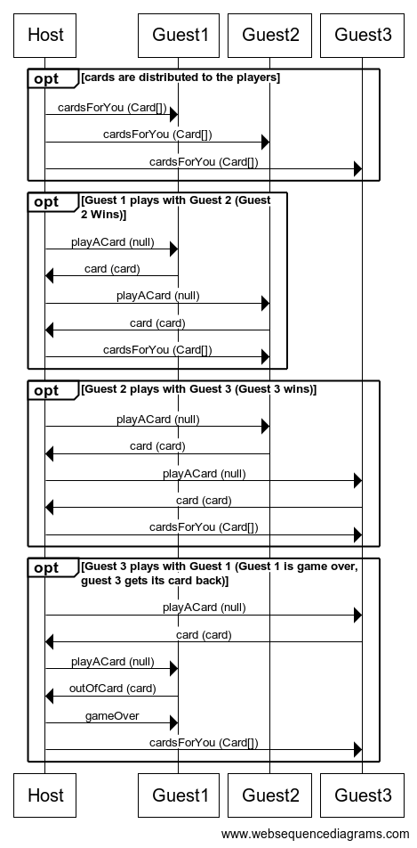

# Règles du Président :

Le jeu se joue à au moins deux joueurs et comporte un maitre du jeu non joueur.
Le but du jeu est de ne plus avoir de cartes en main.

## Les valeurs des cartes sont presentés ci dessous du plus fort au moins fort :
Deux, As, Roi, Dame, Valet, Dix, Neuf, Huit, Sept, Six, Cinq, Quatre, Trois

## Règles d'une partie :
- Au début de la partie les cartes sont distribués équitablement
- Si c'est la première partie : Le joueur qui a la dame de cœur commence (prend la main)
- Si ce n'est pas la première partie : Le Trou du Cul commence (prend la main)
- Le jeu se déroule dans le sens des aiguilles d'une montre
- Le jeu fonctionne en pli 

### Fonctionnement d'un pli :
Un pli de jeu commence quand un joueur prend la main  Il choisit si il joue en simple, en paire, en triple ou en carré et joue le nombre de cartes qu'il a indiqué. Il impose donc le nombre de carte qui doit être joué pour écouler les cartes pendant ce pli.
Chaque joueur doit jouer une ou plusieurs cartes au dessus ou égale à la valeur de la ou les cartes précédentes déposées.

### La carte précédente ou rien :
Cette situation apparaît quand on joue en simple, pour cela il faut qu'il y ait deux cartes d'affilés de même valeur. Alors le joueur suivant devra jouer la carte de la valeur demandée sinon il passe son tour.

### Le pli se termine à trois conditions :
 - Un joueur joue un ou plusieurs deux (en respectant le nombre de cartes demandés), il prend donc la main pour le prochain pli
 - Personne ne peut pas ou ne veut pas jouer au dessus du dernier joueur qui posé un ou plusieurs cartes. Alors, le dernier joueur qui a joué prend la main pour le prochain pli
 - Enfin, le pli ce termine quand une personne pose une ou plusieurs cartes et personne a joué de carte avant qu'il rejoue, il prend donc la main pour le prochain pli
 
### La révolution :
La révolution apparait quand un joueur pose 4 fois la même valeur de carte, il prend donc la main pour le prochain pli. Cependant après une révolution les valeurs de cartes sont inversées. Si plusieurs révolutions s'enchainent alors la révolution s'annule.

#### L'ordre après une révolution devient alors (du plus fort au moins fort) :
Trois, Quatre, Cinq, Six, Sept, Huit, Neuf, Dix, Valet, Dame, Roi, As, Deux

## Règles sur plusieurs parties :
Pour cela on prend les résultats de la dernière partie qui a eu lieu :
- Le premier de la dernière partie (Président) donne deux cartes de son choix au Trou du Cul
- Le deuxieme de la dernière partie (Vice-Président) donne une arte de son choix au Vice-Trou du Cul
- L'avant dernier de la dernier partie (Vice-Trou du Cul) donne sa meilleur carte au Vice-Président
Le dernier de la dernière partie (Trou du Cul) donne ses deux meilleurs cartes au Président

Attention si un joueur termine par un deux ou un trois sous révolution, il devient alors Trou du Cul si il a deja une personne ou plusieurs personne ayant deja terminé par un deux alors il prend le role au dessus de la dernière personne qui a terminé par un deux.

### Détail des classes principales

Un exemple de jeu supportant le réseau

* LocalWarGame la version du jeu supportant le jeu en local
* WarGameEngine le moteur du jeu
* WarGameNetorkPlayer le joueur distant en cas de partie réseau
* WarGameNetworkEngine la version du jeu supportant le réseau

# Protocole réseau

> Le protocole réseau définit les séquences des commandes échangées entre les différentes parties prenantes. Il doit contenir, pour chaque commande, l'expéditeur, le destinataire, le nom de la commande et le contenu du corps de la commande.

